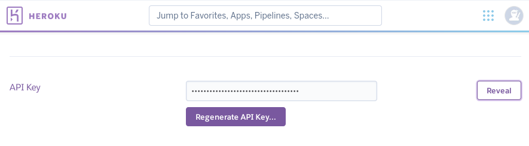
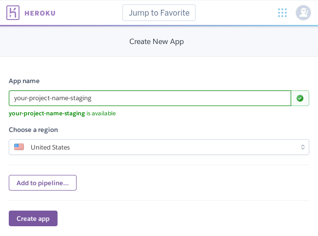
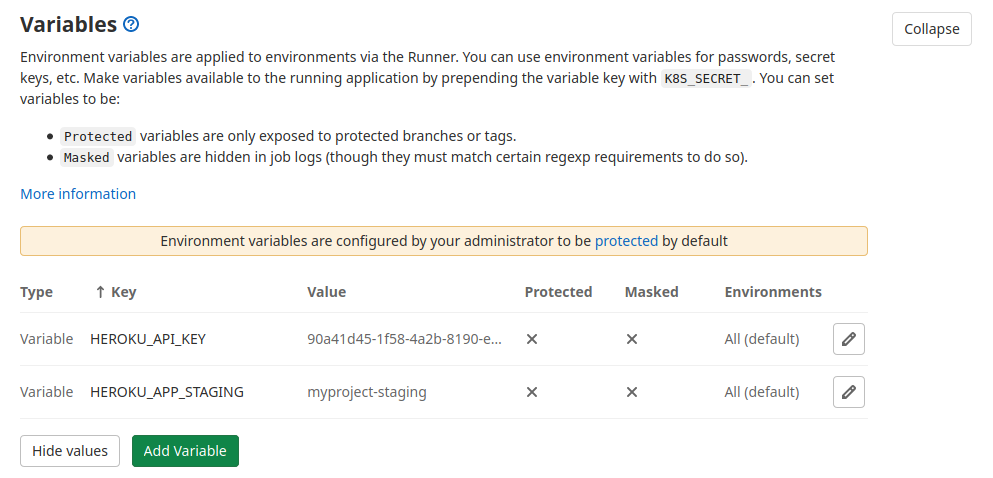

## Set up GitLab continuous delivery

We will use GitLab CI/CD for continuous deployment on Heroku which is a platform as a service
that enables developers to build, run, and operate application entirely on cloud.

### Create an account on Heroku

To start using Heroku you will first need to create an account:

1. Go to https://www.heroku.com and click the `SIGN UP FOR FREE` button.
2. Enter your details and then press `CREATE FREE ACCOUNT`.
    You'll be asked to check your account for a sign-up email.
3. Click the account activation link in the signup email.
    You'll be taken back to your account on the web browser.
4. Enter your password and click `SET PASSWORD AND LOGIN`.
5. You'll then be logged in and taken to the Heroku dashboard: https://dashboard.heroku.com/apps.

To view the `API Key` of your account, visit `Account Settings` and click on the `Reveal` button.



### Create an app on Heroku
On your Heroku account, click on `New` > `Create new app`, name it `<YOUR_PROJECT_NAME>-staging`.



### Set up GitLab CD variables
On your GitLab project repository, visit `settings` > `CI/CD`, and click on `Expand` button of the `Variables`.

Add the below two variables and uncheck masked and protected flags:
1. Key: `HEROKU_API_KEY`, Value: `API key` from Heroku `Account Settings`
2. Key: `HEROKU_APP_STAGING`, Value: `<YOUR_PROJECT_NAME>-staging` name of the app that you have created on Heroku.



### Activate delivery when the the GitLab pipeline is triggered
Append the below lines to the `.gitlab-ci.yml` at the end of the file:

```yaml
staging:
    stage: deploy
    before_script:
        - apt-get update -qy
        - apt-get install -y ruby-dev
        - gem install dpl
    script:
        - dpl --provider=heroku --app=$HEROKU_APP_STAGING --api-key=$HEROKU_API_KEY --run='python manage.py migrate'
```

Create a new commit for the changes in the `.gitlab-ci.yml` and push the changes to the origin.

On your GitLab project repository, visit CI/CD > Pipelines and check the progress of the `staging` stage in the pipeline.

[Staging pipeline](docs/imgs/pipeline-staging.png)
